---

author      : Aishwarya Venkat
job         : Eco Health Net Intern
framework   : deckjs        # {io2012, html5slides, shower, dzslides, ...}
deckjs      : {theme: swiss, transition: fade}
highlighter : highlight.js  # {highlight.js, prettify, highlight}
hitheme     : hemisu-light      # 
widgets     : mathjax            # {mathjax, quiz, bootstrap}
mode        : selfcontained # {standalone, draft}
knit        : slidify::knit2slides
assets      : {assets: ../../assets}

---

<center>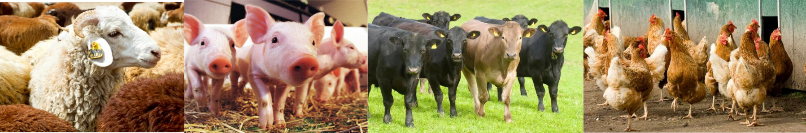</center>
<br></br>
<br></br>

# African Sustainable Livestock 2050

### Aishwarya Venkat
### EcoHealth Net Research Exchange Intern, Summer 2017


---

## About Me

<center>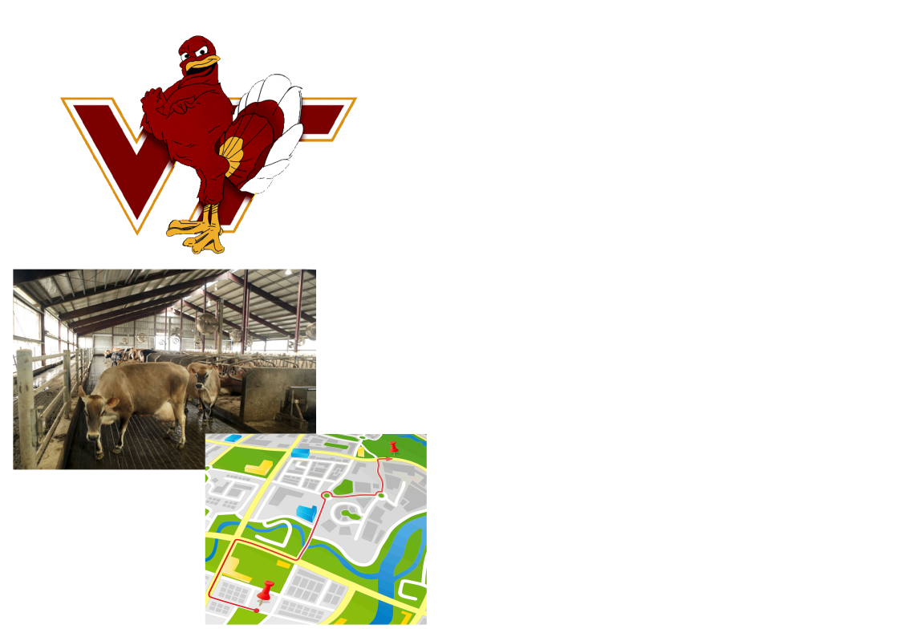</center>

---

## About Me

<center>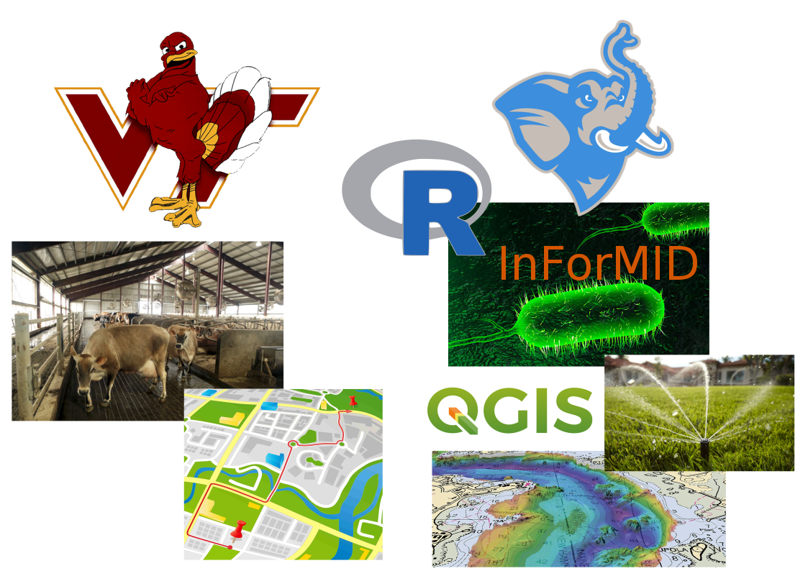</center>

---

## African Sustainable Livestock (ASL) 2050

* FAO project funded by USAID
* Goals: 
  - identify opportunities and threats associated with the long-term development of livestock
  - agree upon priority reforms and investments, and the capacity needed for their implementation, to ensure sustainable development of the livestock sector in the next three or four decades.
* Countries:  Burkina Faso, Egypt, Ethiopia, Kenya, Nigeria and Uganda
  
* EHA work:
  - Metaflu ([Hosseini et al, 2013](http://journals.plos.org/plosone/article?id=10.1371/journal.pone.0080091)) package to simulate dynamics of avian influenza spread
  - Kate's work: variable farm sizes, culling

---

## Small World Networks


<center>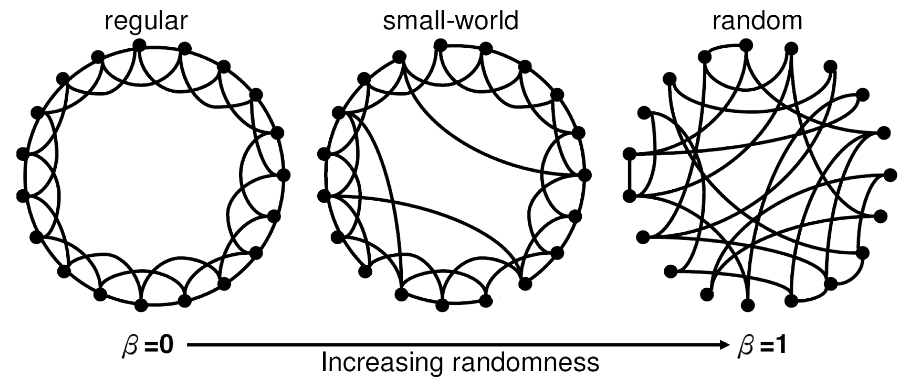</center>

<br>
Watts, Duncan J., and Steven H. Strogatz. [Collective dynamics of 'small-world' networks](https://www.nature.com/nature/journal/v393/n6684/full/393440a0.html), Nature 393.6684 (1998): 440

--- 

## Random Spatial Networks

* Primary data source: Country-level Livestock Survey data aggregated by FAO

```{r, eval=T, echo=F}

options(scipen = 999)
round(read.csv("data_sample.csv")[1:3,], 3)

```

My tasks:
  - Ground Metaflu simulations in reality through country-wide poultry sector information
  - Apply Small World Network principles to Random Spatial Networks
  - Identify limitations of existing data, and generate models and questions to share with FAO theme leaders

--- 

## Approach: Households

> * Household/Backyard chicken production density from [Marius et al, 2015](http://journals.plos.org/plosone/article?id=10.1371/journal.pone.0133381#sec002)

<center>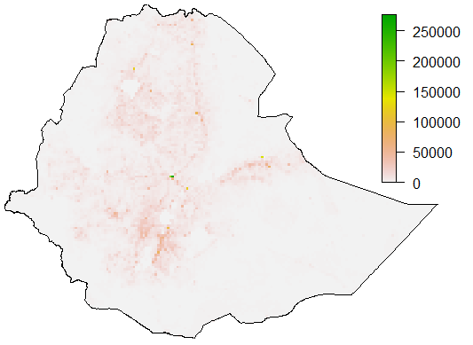</center>

> * Use this as probability surface to distribute households within country

---

## Aproach: Commercial Farms

>   * Get number and sizes of commercial farms from literature, poultry sector reports (Ethiopia, Kenya, Uganda), or scraped from [OIE](http://www.oie.int/wahis_2/public/wahid.php/Wahidhome/Home) & [FAO EMPRES-I](http://empres-i.fao.org/eipws3g/) outbreak data

>   * Fit lognormal model to farm size, sample randomly from distribution until value adds up to total estimated intensive chicken population

<center>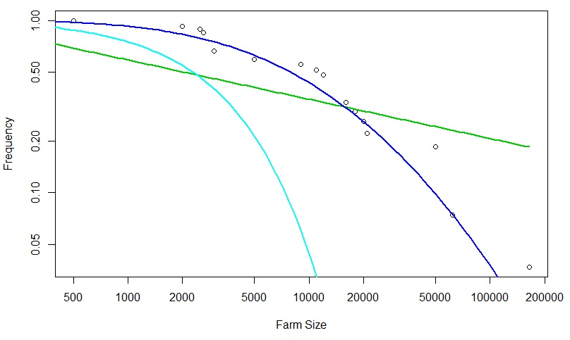</center>

---

## Aproach: Commercial Farms

>   * Distribute points based on intensive poultry production raster

<center>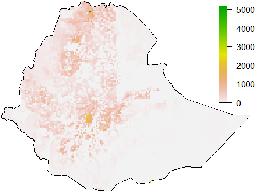</center>

---

## Approach: Markets

>   * Ethiopia, Uganda, Kenya: [Intergovernmental Authority on Development (IGAD)](www.igad.int) 

>   * Burkina Faso, Egypt, Nigeria: Populated Places data from [OpenStreetMap](http://download.geofabrik.de/africa/) and [SEDAC GRUMP](http://sedac.ciesin.columbia.edu/data/set/grump-v1-settlement-points-rev01/)

<center>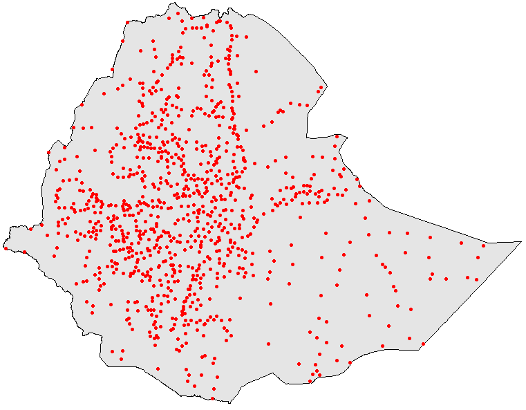</center>

--- 

## Combining Data

<br>

<center>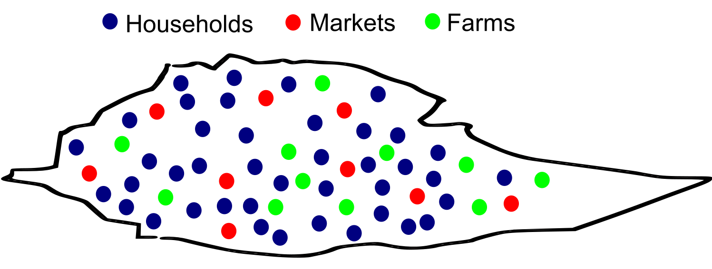</center>

---

## Parametrize connectivity

<br>

<center>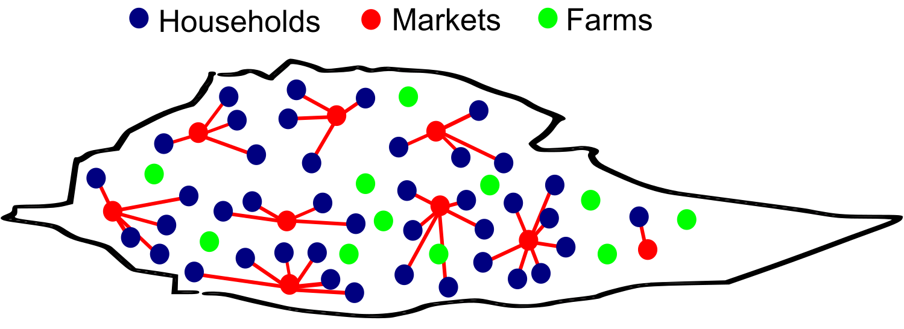</center>

<center>Each household is connected to nearest market</center>

---

## Parametrize connectivity

<br>

<center>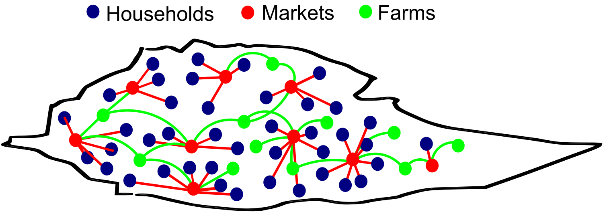</center>

<center>Each farm is connected to multiple markets</center>

---

## Parametrize connectivity: households

<br>

<center>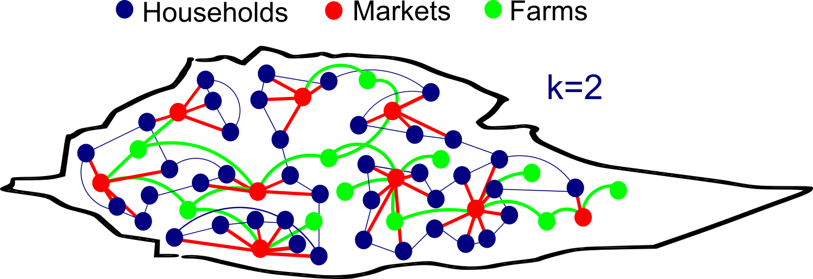</center>

<center>Each household is connected to two other households</center>

---

## Parametrize connectivity: households

<br>

<center>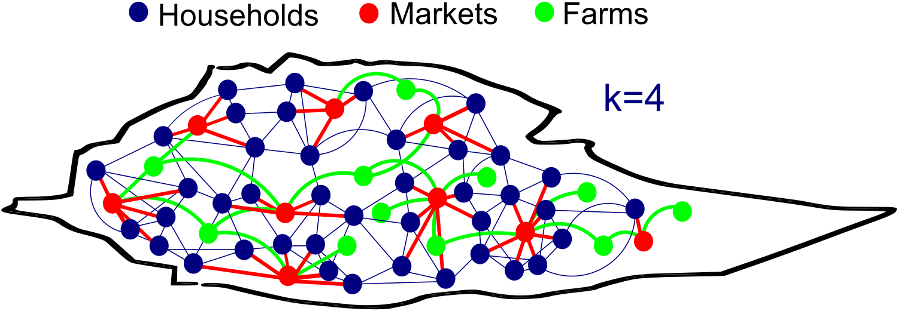</center>

<center>Each household is connected to four other households</center>

---

## Connecting poultry sector actors

<br>
$$p_{u,v} = min\Bigg(\kappa_u\kappa_v\frac{f(d_{uv})}{\rho\langle\kappa\rangle},1\Bigg)$$

$u,v = $ two nodes (any of households, markets, farms)
<br>
$ p = $ probability of connection between nodes $u$ and $v$
<br>
$f(d_{uv}) = $ exponential decay kernel connecting nodes, defined by a distance (rate) at which 50% of nodes in country are connected
<br>
$\kappa = $ expected degree of connections per node (Poisson distributed across nodes)
<br>
$\langle\kappa\rangle = $ average degree of connections for all nodes
<br>
$\rho = $ density of nodes within country
<br>
<br>

Lang, John, et al. [Random Spatial Networks: Small Worlds without Clustering, Traveling Waves, and Hop-and-Spread Disease Dynamics](https://arxiv.org/pdf/1702.01252.pdf). arXiv:1702.01252 (2017).

---

## Progress

* Identified data sources for all six countries, validation and review in progress 
* Pipeline for analysis and input into Metaflu defined
* Experiments to test kappas and distances (rates) for reproducibility across countries

## Next Steps

* Network generation for all ASL countries
* Analysis of network modularity 
* Local outbreak probability analysis
* Writing and publication of results 

---

## Skills learned

* GIT!
* Parallel processing 
* Network analysis in igraph
* Sparse matrices
* Geographically weighted principal components analysis (PCA)
* Raster stack manipulation and raster PCA
* Random forest models and boosted regression trees

---

## Acknowledgements

* Noam Ross

* Cale Basaraba

* Allison White 

* Carlos Zambrana-Torrelio

* Modeling & Analytics team

<center></center>

